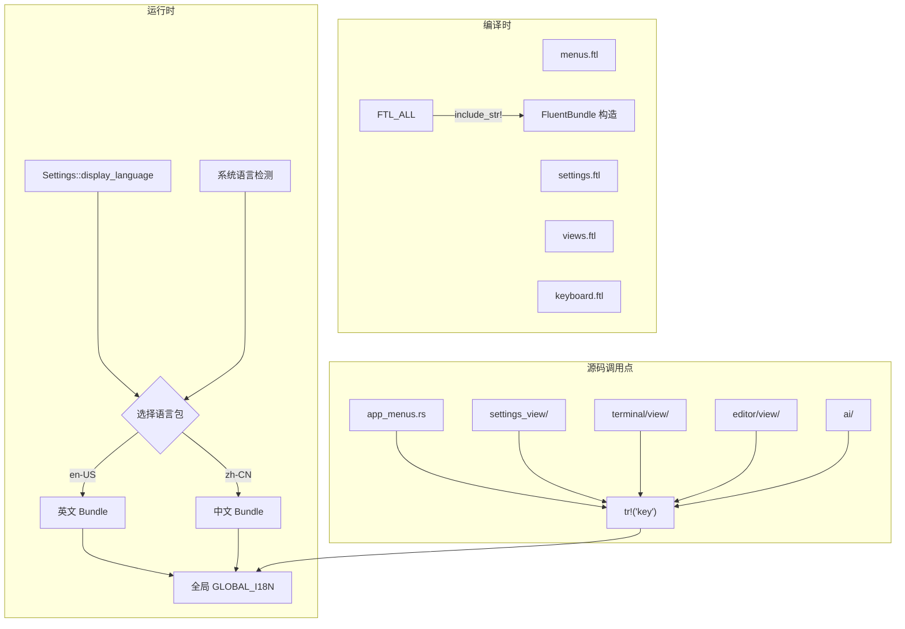

## 用户需求

将 Warp 终端应用程序的 UI 界面语言从英文完整汉化为简体中文（zh-CN）。使用 Fluent（project-fluent）作为国际化框架，新建 i18n 基础设施 crate，覆盖所有 65+ crate 中的约 1200+ 个 UI 字符串，涉及 100+ 个源文件的修改。

## 产品概述

为 Warp 终端增加完整的国际化能力，默认保留英文（en-US）作为回退语言，新增简体中文（zh-CN）作为可选显示语言。用户可通过设置界面切换语言，应用重启后生效。所有菜单栏、设置页面、对话框、按钮标签、状态提示等 UI 文本均获得中文翻译。

## 核心功能

- **i18n 基础设施**：新建 `crates/i18n/` crate，封装 Fluent bundle 管理、编译时 FTL 文件嵌入、`tr!()` 翻译宏
- **语言设置**：在设置系统中新增 `display_language` 选项，支持 en-US / zh-CN 切换，默认跟随系统语言
- **全量汉化**：翻译所有菜单项（~45 条）、设置描述（~110 条）、设置页面 UI（~1000 条）、键盘快捷键标签（~15 条）、终端/编辑器/AI 视图字符串（~100 条）
- **格式化支持**：使用 Fluent 变量语法处理带参数的动态字符串（如文件名、快捷键名称等）

## 技术栈

- **i18n 框架**：`fluent` + `fluent-bundle` + `intl-memoizer`（Rust Fluent 生态标准组合）
- **翻译文件格式**：Fluent `.ftl` 文件，按功能域分文件组织
- **运行时语言切换**：基于全局 `RwLock<FluentBundle>` 存储当前语言包，`tr!()` 宏在运行时查找翻译
- **编译时嵌入**：通过 `include_str!()` 将 FTL 文件编译进二进制，零运行时 I/O
- **系统语言检测**：macOS 使用 `NSLocale` API（已有 `platform.rs` 中的相关代码可复用），其他平台使用 `std::env::var("LANG")`

## 实现方案

### 整体策略

采用**自底向上**策略：先建基础设施（i18n crate + 宏系统），再按功能域批量替换硬编码字符串，最后集成设置开关。

### 核心架构

### 关键设计决策

1. **全局静态 Bundle 而非上下文传递**

- 理由：Warp 的 UI 代码深度嵌套在 ECS 组件中，逐层传递语言上下文会触及数百个函数签名
- 实现：`static GLOBAL_I18N: RwLock<Option<FluentBundle<FluentResource>>>` 
- 风险：全局状态理论上不优雅，但对于个人 fork 是最务实的方案
- 缓解：仅在应用启动时写入一次，运行时只读不改

2. **按功能域分 FTL 文件**

- `locales/zh-CN/menus.ftl` — 菜单栏字符串
- `locales/zh-CN/settings.ftl` — 设置描述及页面标签
- `locales/zh-CN/views.ftl` — 终端/编辑器/AI 视图字符串
- `locales/zh-CN/keyboard.ftl` — 键盘修饰键/特殊键名
- 好处：模块化管理，减少合并冲突，方便按领域审查翻译质量

3. **`tr!()` 宏设计**

- 基础形式：`tr!("menu-file-new-tab")` → 返回 `String`
- 带变量：`tr!("dialog-confirm-delete", name = file_name)` → Fluent 变量替换
- 带数量：`tr!("n-items-selected", count = n)` → Fluent 复数形式（当前仅需中文/英文两种）
- 回退：若 key 在当前语言包中不存在，回退到英文 Bundle，仍失败则返回 key 本身作为兜底
- 实现：过程宏或声明宏。推荐声明宏（`macro_rules!`），简单可靠，无需额外 proc-macro crate

4. **设置集成策略**

- 在 `app/src/settings/` 中新增 `i18n.rs`，用 `define_settings_group!` 定义 `I18nSettings { display_language: String }`
- 默认值：尝试检测系统语言 → 若为中文则 `"zh-CN"`，否则 `"en-US"`
- 设置 UI：在 `appearance_page.rs` 中添加语言下拉选项

### 性能考量

- FluentBundle 构造仅在启动时执行一次，O(n) 解析 FTL 文件（~1200 条消息，耗时 < 50ms）
- `tr!()` 每次调用需获取 RwLock 读锁 → `String` 克隆（UTF-8 字符串，通常 < 100 字节）
- 对于高频调用点（如帧渲染循环中的状态文本），考虑在调用侧缓存翻译结果

### 防回退（Blast Radius）

- 所有修改使用 `tr!()` 宏替换原文字符串，英文原文保留在 `en-US.ftl` 中作为回退
- 不删除任何原英文字符串，只是将其移入 FTL 文件
- 若 i18n bundle 加载失败（如 FTL 语法错误），程序仍以英文正常运行
- 新增 crate 不影响现有 crate 的编译依赖图（仅在被引用时才链接）

## 代理扩展

### SubAgent

- **code-explorer**
- 用途：在计划执行阶段批量探索各 crate 中的硬编码字符串位置，确认需要修改的确切文件和行号
- 预期结果：每个功能域（菜单、设置、终端、编辑器、AI）的完整字符串清单及精确文件路径

### Skill

- **writing-plans**
- 用途：生成和管理分阶段执行计划文件（task_plan.md、findings.md、progress.md）
- 预期结果：结构化的进度跟踪文件，支持跨会话恢复执行