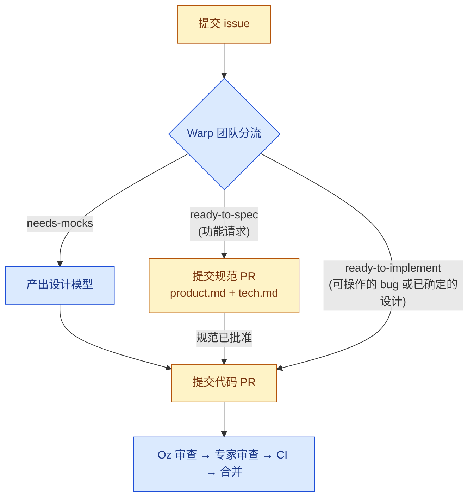

# 为 Warp 贡献代码

感谢你帮助改进 Warp！本指南说明了如何提交 issue、提出变更以及让你的工作通过审查。

> [!TIP]
> **在 Slack 上与我们交流。** 在 [`#oss-contributors`](https://warpcommunity.slack.com/archives/C0B0LM8N4DB) 频道中与其他贡献者和 Warp 团队联系——这是在你处理 issue 或 PR 期间提出临时问题、讨论设计和与维护者配对的好地方。新来的？先[加入 Warp Slack 社区](https://go.warp.dev/join-preview)，然后跳转到 `#oss-contributors`。

## 简明摘要

- 一旦报告具有可操作性（从提供的详细信息或维护者分流确认），bug 修复即被接受。
- 功能请求必须先标记为 `ready-to-spec` 或 `ready-to-implement`，然后才会接受 PR。
- 规范文档是对较大 issue 进行技术和设计讨论的地方。
- Oz 自动对传入的 issue 进行分流，并审查开放的 PR。
- 实现类 PR 必须包含手动测试的证明。

## Warp 的贡献机制如何运作

Warp 的贡献模型由 [Oz](https://oz.warp.dev) 塑造，这是一个自动化分流、规范编写、实现和审查部分的智能体。与典型的开源仓库相比，这里的几个地方有所不同：

- **Issue 是一切工作的起点。** 讨论、范围和设计在打开任何 PR 之前发生在 issue 上。
- **功能请求与 bug 修复不同：**
  - 功能由就绪标签控制——首先是 `ready-to-spec`，然后在设计确定后是 `ready-to-implement`——这些标签标志着贡献者可以开始工作。仅有讨论不等于批准开始工作。
  - 功能工作需要先有书面规范：功能请求在经过规范 PR（一个*产品规范* + *技术规范*，提交到 [`specs/`](specs/) 目录下）后才能开始编写代码。
  - Bug 修复一旦报告可复现或具有可操作性，可以直接进入代码 PR；除非范围或设计不明确，它们不需要规范 PR。
- **审查在很大程度上是自动化的。** 当你打开 PR 时，Oz 会自动分配并进行初步审查。一旦 Oz 批准，它会自动请求 Warp 团队的主题专家进行后续审查——你不需要自己分配人类审查者。

### 就绪标签

当 issue 准备好接受贡献时，Warp 团队会应用以下标签之一：

- **`ready-to-spec`** — 问题已被理解但设计是开放的。在 [`specs/`](specs/) 下提交一个包含*产品规范*（`product.md`）和*技术规范*（`tech.md`）的规范 PR——详情参见[提交规范 PR](#提交规范-pr)。此标签**仅用于功能请求**。
- **`ready-to-implement`** — issue 已准备好接受代码 PR。对于 bug，这意味着报告足够可复现或可操作，且可能的修复不需要规范、模型或更深入的调查。
- **`needs-mocks`** — 在开始实现之前需要设计模型。等待 Warp 团队完成它们。

任何人都可以认领准备好的 issue——就绪标签不是分配，最佳的实现通过正常审查胜出。如果某个 issue 一直未被分流，或者你希望对就绪状态重新评估，请在评论中提及 **@oss-maintainers** 以提醒团队。

## 贡献流程

由你（贡献者）负责的步骤以黄色显示；由 Warp 团队或 Oz 负责的步骤以蓝色显示。



## 提交一个好的 Issue

在提交前搜索[已有 issue](https://github.com/warpdotdev/warp/issues)以避免重复。提交时使用 issue 模板。

如果你已经在运行 Warp，最快的提交方式是通过 `/feedback` 命令——它会自动打开一个公开的 GitHub issue 并附上相关上下文（日志、环境详情）。

### Bug 报告

一个好的 bug 报告应包括：

- 清晰的标题和一段问题摘要。
- 复现步骤（尽可能提供最简示例）。
- 预期行为 vs. 实际行为。
- Warp 版本和操作系统（参见 `设置 → 关于`）。
- 相关的日志、截图或屏幕录制。

一旦 issue 被（由 Oz 的分流智能体或维护者）分流为可操作的 bug，它可能会被标记为 **`ready-to-implement`**，以便你可以认领并提交代码 PR。

### 功能请求

一个好的功能请求在提出任何实现方案之前，先描述面向用户的问题。包括：

- 用户需求或痛点，以及谁受到影响。
- 当前行为及其不足之处。
- 所需行为或工作流的草图（简短的示例或模型有帮助但不是必需的）。
- 任何相关约束（兼容性、相关功能、先前技术等）。

功能请求是通过规范流程的路径：当问题被理解且设计对贡献者开放时，维护者会应用 **`ready-to-spec`**。从那时起，下一步是规范 PR——而不是代码 PR。

自动分流可能会添加信息标签（`area:*`、`repro:*` 等）。这些不影响就绪状态。

## 提交规范 PR

标记为 `ready-to-spec` 的 issue 在开始编码之前需要规范。规范由两个短文档组成，提交在 [`specs/GH<issue-number>/`](specs/) 下：

- **`product.md`**（*产品规范*）— 从消费者角度（用户、API 调用者、CLI 用户等）定义所需行为，不涉及实现细节。核心是一个编号列表，列出**可测试的行为不变式**，涵盖正常路径、用户可见状态、输入和响应，以及边界情况（空/错误/加载、取消、离线、权限拒绝、竞态条件、可访问性）。可选部分：问题陈述、目标/非目标、Figma 链接、开放问题。
- **`tech.md`**（*技术规范*）— 基于此代码库的实现计划。必需部分：**上下文**（当前系统及带有行引用的相关文件）、**提议的变更**（涉及的模块、新的类型/API/状态、数据流、权衡）和**测试与验证**（如何验证产品规范中的每个不变式）。可选：端到端流程、Mermaid 图表、风险、并行化、后续工作。

提交规范 PR：

1. 添加 `specs/GH<issue-number>/product.md` 和 `specs/GH<issue-number>/tech.md`。参见 [`specs/GH408/`](specs/GH408/)、[`specs/GH1063/`](specs/GH1063/) 和 [`specs/GH1066/`](specs/GH1066/) 了解结构良好的规范示例，浏览 [`specs/`](specs/) 获取更多。可以使用 [`/write-product-spec`](.agents/skills/write-product-spec/SKILL.md) 和 [`/write-tech-spec`](.agents/skills/write-tech-spec/SKILL.md) 技能来搭建这些文档。
2. 将 PR 作为产品和技术讨论的场所。
3. 一旦规范被批准，实现通常在同一 PR 上继续。在较少见的情况下——例如，如果大型规范被单独合并以便实现可以拆分——它可以转移到关联的后续 PR。

## 提交代码 PR

对于标记为 `ready-to-implement` 的 issue：

1. 从 `master` 分支。
2. 实现变更并添加测试（参见[测试](#测试)）。
3. 在推送之前运行 `./script/presubmit` 并修复所有失败。
4. 使用 [pull request 模板](.github/pull_request_template.md)打开 PR，并添加 changelog 条目（`CHANGELOG-NEW-FEATURE`、`CHANGELOG-IMPROVEMENT` 或 `CHANGELOG-BUG-FIX`）；仅对于纯文档或纯重构变更可以省略。
5. 保持 PR 专注于单一逻辑变更，并在 PR 进入审查之前合并 `master`。

你**不需要手动请求审查者**。Oz 会自动分配给针对已就绪 issue 的 PR，并进行初步审查。Oz 批准后，它会自动请求相应的 Warp 团队主题专家进行后续审查。

在推送解决 Oz 反馈的变更后，在 PR 上评论 `/oz-review` 以请求重新审查——每个 PR 最多可以这样做**三次**。如果看起来卡住了或者你需要超过此数量的审查，在 PR 上提及 **@oss-maintainers** 以升级给团队。

**你必须包含[手动测试](#手动测试)的证明**。对于小的、独立的、视觉性的变更，你应该包含**前后截图**。对于更大的、广泛的或交互式的变更，你还应该包含一个**带解说的屏幕录制**。

如果维护者对你的 PR 提出修改要求，你需要再次请求 `/oz-review` 并通过它，然后才能请求重新审查。一旦你通过了 Oz 的审查，Oz 将自动为你请求重新审查。

## 使用编码智能体

你可以使用**任何编码智能体**来实现贡献——例如，Warp 的内置智能体、Claude Code、Codex、Gemini CLI 或其他——或者完全不使用智能体。本仓库提供了智能体可读取的上下文（[`.agents/skills/`](.agents/skills/) 下的技能、[`specs/`](specs/) 下的规范以及 [`WARP_zh-CN.md`](WARP_zh-CN.md)），任何支持这些格式的工具都可以使用。

如果你更希望由 **Oz 云智能体**为你实现一个就绪的 issue，在 issue 上提及 **@oss-maintainers** 来请求。批准的请求将在**免费的**赠送 Oz 积分上运行——你不需要设置自己的 Oz 账户或支付计算费用。

虽然你可以使用编码智能体进行实现，但我们期望贡献者**亲自与我们协作**。这意味着你不应该使用像 OpenClaw 这样的智能体与我们的团队进行对话。我们的维护者始终会把你当作人类来交谈，所以请你也把我们当作人类来交谈。

## 代码审查

所有 pull request 都经过两阶段审查流程：

1. **Oz 审查** — 当你打开 PR 时，[Oz](https://warp.dev/oz) 会自动分配并进行第一次审查。Oz 检查正确性、风格、测试覆盖以及与关联 issue 和任何相关规范的一致性。
2. **Warp 团队审查** — 只有在 Oz **批准** PR 之后，它才会被转给 Warp 团队的主题专家进行最终人工审查。尚未被 Oz 批准的 PR 不会被分配给团队成员。

你在任何阶段都不需要手动请求审查者。在推送解决 Oz 反馈的变更后，在 PR 上评论 `/oz-review` 以请求重新审查——每个 PR 最多可以这样做**三次**。如果看起来卡住了或者你需要额外的审查，在 PR 上提及 **@oss-maintainers** 以升级给团队。

## 开发环境设置

参见 [README_zh-CN.md](README_zh-CN.md) 和 [WARP_zh-CN.md](WARP_zh-CN.md) 获取完整的工程指南。快速入门：

```bash
./script/bootstrap   # 平台特定设置
cargo run            # 构建并运行 Warp
./script/presubmit   # 格式化、clippy 和测试
```

## 测试

大多数代码变更都需要测试：

### 手动测试
对于可以手动测试的变更，手动测试是必需的，而且几乎所有变更都可以手动测试。对于小的、独立的、视觉性的变更，你应该包含**前后截图**。对于更大的、广泛的或交互式的变更，你还应该包含一个**带解说的屏幕录制**。

你可以使用 `./script/run` 在本地运行应用——参见 [WARP_zh-CN.md](WARP_zh-CN.md) 了解设置详情。

### 自动化测试
- **Bug 修复**应该包括一个能够捕获该 bug 的回归测试。
- **算法性或非平凡的逻辑**需要单元测试。
- **面向用户的流程**应该在 [`crates/integration/`](crates/integration/) 下有端到端覆盖，只要行为可以通过这种方式执行。标准是对你发布的变更有高质量的覆盖——在使用智能体驱动的开发中，期望是更多的集成测试，而不仅仅是 P0 路径的覆盖。如果一个流程值得发布，它通常值得一个集成测试。

使用 `cargo nextest run` 运行单元测试。

## 代码风格

- `cargo fmt` 和 `cargo clippy --workspace --all-targets --all-features --tests -- -D warnings` 必须通过。
- 优先使用 imports 而非路径限定符，使用内联格式参数（`println!("{x}")`），以及穷举 `match` 而非 `_` 通配符。
- 参见 [WARP_zh-CN.md](WARP_zh-CN.md) 获取完整的风格指南，包括 WarpUI 模式和终端模型锁定规则。

## 提交和分支约定

- 分支名称应以你的句柄为前缀（例如 `alice/fix-parser`）。
- 提交信息应解释*做了什么*和*为什么*做，而不仅仅是*做了什么*。

## 行为准则

本项目采用 [Contributor Covenant](https://www.contributor-covenant.org/)（v2.1）作为其行为准则。所有贡献者和维护者应在每个项目空间中都遵守它。参见 [`CODE_OF_CONDUCT.md`](CODE_OF_CONDUCT.md) 获取全文，或通过 warp-coc at warp.dev 举报违规行为。

## 报告安全问题

参见 [`SECURITY.md`](SECURITY.md) 了解我们的安全披露政策和私下报告渠道。**不要为安全漏洞提交公开 issue。**

## 获取帮助

- 在 [Warp Slack 社区](https://go.warp.dev/join-preview)的 [`#oss-contributors`](https://warpcommunity.slack.com/archives/C0B0LM8N4DB) 中与其他贡献者和 Warp 团队交流（如果你是新来的，先加入工作区）。
- 浏览 [Warp 文档](https://docs.warp.dev/)。
- 提交 [GitHub issue](https://github.com/warpdotdev/warp/issues) 报告 bug 或功能请求。
